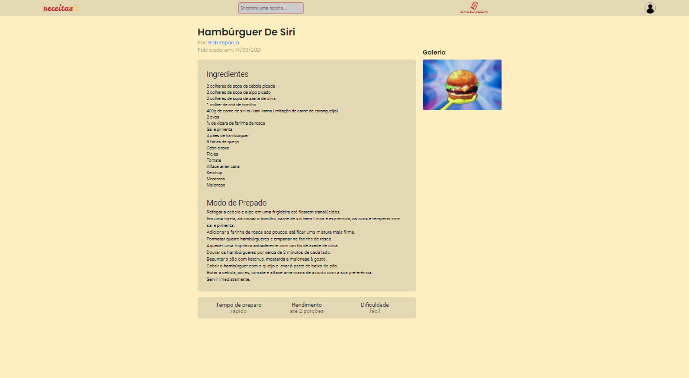
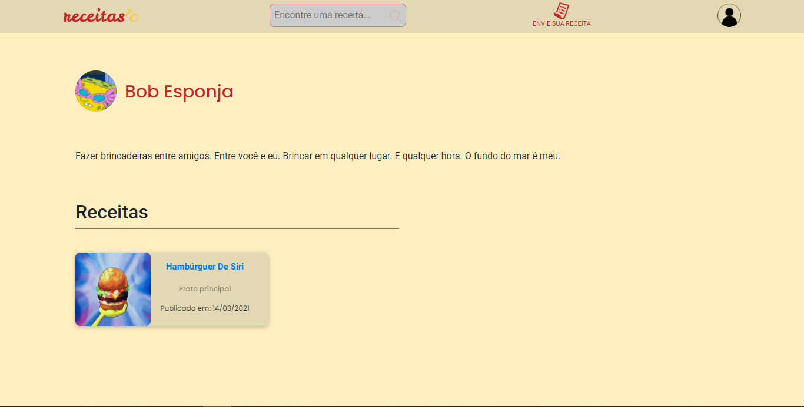

# receitas 10

[](https://gitpod.io/#https://github.com/Mikael-R/receitas10)

[](LICENSE.md) [](https://github.com/Mikael-R/receitas10/commits/)  [](https://github.com/Mikael-R/receitas10/issues) 

[](https://github.com/Mikael-R/receitas10/network/members) [](https://github.com/Mikael-R/receitas10/stargazers) [](https://github.com/Mikael-R/receitas10/watchers)


<h1 id="title" align="center">Bem vindo ao receitas 10 👋</h1>

<h4 align="center">🚧 receitas 10 em desenvolvimento... 🚧</h4>

> Um site de uma comunidade de receitas cheia de sabores 😋

<details>
<summary>Screenshots</summary>

<br>

</details>

### 🔖 Tabela de guia

- 🤔 [Como utilizar](#como-usar)
- 🚀 [Tecnologias](#tecnologias)
- 🌱 [Minimal Requirements](#requisitos-mínimos)
- 📐 [Layout no figma](https://www.figma.com/file/nBYTZeTBwMGNP07cbEidf0/Receitas10)
- 🎊 [Features](#features)
  - 🎇 [Concluídas](#features-concluídas)
  - 🎇 [Pendentes](#features-pendentes)
- 💡 [Como contribuir](#como-contribuir)
- 🤗 [Contribuidores](#contribuidores)
- 👤 [Autores](#autores)
- 🔏 [Licença](#licensa)

---

<h2 id="como-usar">🤔 Como utilizar</h2>

#### 💻 Desktop

Para fins de exemplo usarei o yarn como gerenciador de pacotes mas você pode utilizar o seu preferido.
Caso não saiba como instalar, visite [este link](https://imasters.com.br/front-end/ganhando-tempo-rapidez-e-seguranca-com-o-yarn).

Estes comandos funcionam para qualquer gerenciador de pacotes basta trocar pelo nome do seu, por exemplo trocando yarn por node, ``yarn dev`` se tornaria ``node dev``.

Dentro da pasta web, abra o seu terminal e execute:

```sh
yarn  # para baixar as dependências
yarn serve  # para iniciar o servidor
```

Dentro da pasta api, abra seu terminal e execute:

```sh
yarn  # para baixar as dependências
yarn migrations  # para criar o banco
yarn seeds  # para popular o banco com valores default
yarn dev  # para iniciar a api
```

Crie um arquivo `.env` dentro da pasta api e dentro dele coloque:
```
APP_SECRET=&Vr76[Zq
```
Caso não coloque nenhum APP_SECRET não será possível fazer nada que necessite de JWT(Json Web Token). Caso coloque um APP_SECRET diferente do que quando foi gerado o JWT este será inválido e ao fazer login um novo será enviado. Caso queria logar com as contas que estão no seed(precisa desencriptar o hash das senhas para utilizá-las no login), utilize o APP_SECRET acima.

Pronto, basta abrir o seu browser na url http://localhost:8080/login para utilizar.

#### 🌐 Online

Por enquanto não temos um domínio mas não tema pois esse dia chegará!

[Back To The Top](#title)

---

<h2 id="tecnologias">🚀 Tecnologias</h2>

- [NodeJs](https://nodejs.org/)
- [VueJs](https://vuejs.org/)
- [Css3](https://developer.mozilla.org/pt-BR/docs/Web/CSS/)
- [Html5](https://developer.mozilla.org/pt-BR/docs/Web/Guide/HTML/HTML5/)
- [Bootstrap](https://getbootstrap.com/docs/5.0/getting-started/introduction/)
- [Axios](https://github.com/axios/axios/)
- [Babel](https://babeljs.io/)
- [Typescript](https://www.typescriptlang.org/)
- [Express](https://expressjs.com/)
- [SQlite3](https://www.sqlite.org/)
- [JWT](https://jwt.io/)
- [Knex](http://knexjs.org/)
- [BcryptJs](https://github.com/dcodeIO/bcrypt.js)
- [Prettier](https://prettier.io/)
- [Eslint](https://eslint.org/)

[Back To The Top](#title)

---

<h2 id="requisitos-mínimos">🌱 Requisitos Mínimos</h2>

- NPM/Yarn LTS
- NodeJs

[Back To The Top](#title)

---

<h2 id="features">🎊 Features</h2>

<h4 id="features-concluídas">🎇 Concluídas</h4>

- [x] Login / Cadastro
- [x] Perfil
- [x] Home com receitas aleatórias
- [x] Página de receita
- [x] Enviar receita

<h4 id="features-pendentes">🎇 Pendentes</h4>

- [ ] Buscar receitas por nome
- [ ] Recuperar senha
- [ ] Logout
- [ ] Atualizar / Deletar receita
- [ ] Deletar conta
- [ ] Comentar em receita
- [ ] Dar like em receita
- [ ] Botão de compartilhar receita
- [ ] Feed de usuário
- [ ] Enviar imagem como arquivo e não por url
- [ ] Layout responsivo

[Back To The Top](#title)

---

<h2 id="como-contribuir">💡 Como Contribuir</h2>

- Faça um fork deste repositório
- Clone para sua máquina e insira na pasta respectiva
- Crie um branch com seu recurso: `git checkout -b my-feature`
- Faça commit de suas mudanças: `git commit -m 'feat: My new feature'`
- Empurre seu branch: `git push origin my-feature`
- Um botão verde aparecerá no início deste repositório
- Clique para abrir e preencher as informações da solicitação de pull

<p align = "center">
<i> Contribuições, solução de problemas e solicitações de recursos são bem-vindas! </i> <br />
<i> 📮 Envie PRs para ajudar a resolver problemas ou adicionar recursos </i> <br />
<i> 🐛 Encontre e relate problemas </i> <br />
<i> 🌟 Favorite o projeto </i> <br />
</p>

[Back To The Top](#title)

---

<h2 id="contribuidores">🤗 Contribuidores</h2>

<p>

<a href="https://github.com/Mikael-R">
<a href="https://github.com/renatoReboucas">
<a href="https://github.com/AntDavi">

</p>

[Back To The Top](#title)

---

<h2 id="autores">👤 Autores</h2>

🤓 **(FullStack) Mikael Rolim de Aquino <mikarg9@gmail.com>**

- Github: [@Mikael-R](https://github.com/Mikael-R)
- Instagram: [@mikaelr404](https://www.instagram.com/mikaelr404/)
- LinkedIn: [@mikael-rolim-522aa21b1](https://linkedin.com/in/mikael-r)
- Twitter: [@mikaelr16](https://twitter.com/mikaelr16)

🤓 **(FullStack) Renato Rebouças**

- Github: [@renatoReboucas](https://github.com/renatoReboucas)
- Instagram: [@renato_reboucas](https://www.instagram.com/renato_reboucas/)
- LinkedIn: [@renatoReboucas](https://www.linkedin.com/in/renatoReboucas/)
- Twitter: [@https_zero6](https://twitter.com/https_zero6)

🤓 **(Designer e Frontend) Anthony Davi**

- Github: [@AntDavi](https://github.com/AntDavi)
- Instagram: [@sou.eu.anthony](https://www.instagram.com/sou.eu.anthony/)
- LinkedIn: [@antdavi](https://www.linkedin.com/in/antdavi/)


[Back To The Top](#title)

---

<h2 id="licensa">🔏 Licença</h2>

Este projeto é licenciado pela [MIT License](https://api.github.com/licenses/mit).

[Back To The Top](#title)

---

_This README was generated with 💟 by [readme-template-generator](https://github.com/Mikael-R/readme-template-generator)_
